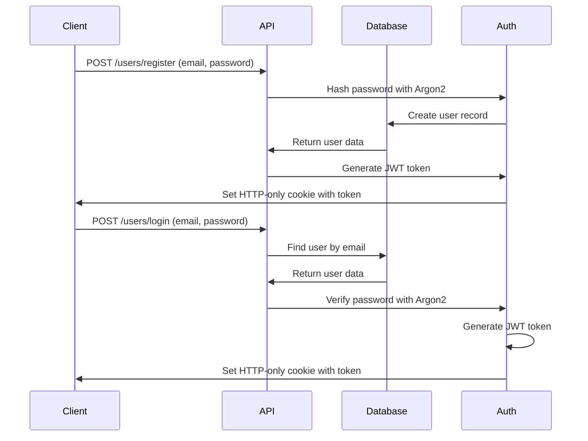
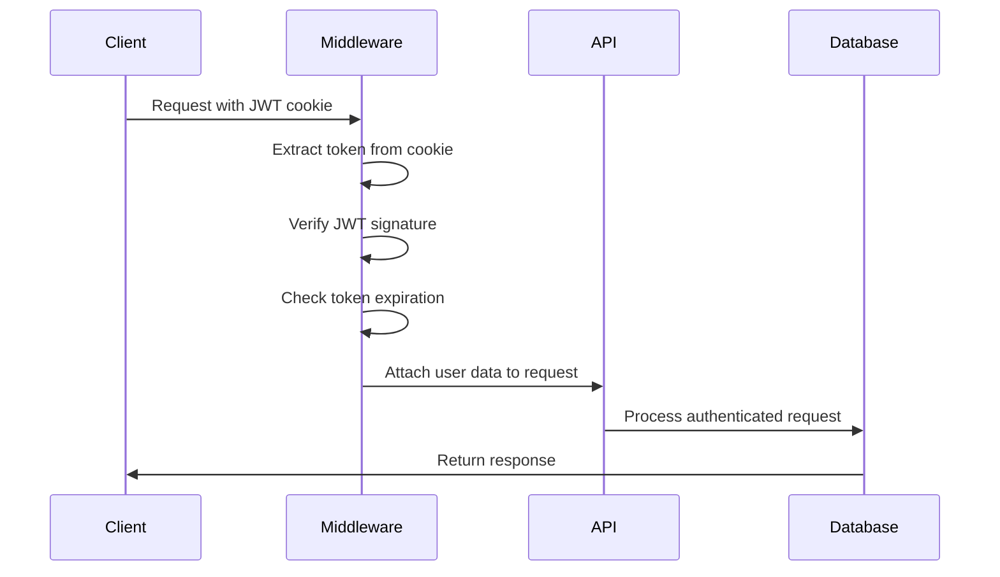

# Backend - Authentication System Documentation

**Last Updated:** September 9, 2025  
**Author:** Development Team  
**Status:** Active

## Table of Contents

- [Overview](#overview)
- [Authentication Flow](#authentication-flow)
- [JWT Implementation](#jwt-implementation)
- [Middleware Components](#middleware-components)
- [Role-Based Access Control](#role-based-access-control)
- [Security Features](#security-features)
- [API Integration](#api-integration)
- [Best Practices](#best-practices)

---

## Overview

The authentication system uses JSON Web Tokens (JWT) with HTTP-only cookies for secure, stateless authentication. The system supports role-based access control with four distinct user roles.

### Key Features

- JWT-based stateless authentication
- HTTP-only cookie storage for security
- Role-based authorization
- Password hashing with Argon2
- Token expiration and refresh handling

### Technology Stack

- **JWT**: JSON Web Tokens for authentication
- **Argon2**: Password hashing algorithm
- **HTTP-only Cookies**: Secure token storage
- **Express Middleware**: Request authentication

---

## Authentication Flow

### User Registration & Login Flow



### Request Authentication Flow



---

## JWT Implementation

### Token Structure

The JWT payload contains essential user information:

```typescript
interface JWTPayload {
  id: string; // User UUID
  email: string; // User email
  role: Role; // User role (USER, SUPPLIER, ADMIN, REVIEWER)
  isSupplier: boolean; // Supplier status flag
  iat: number; // Issued at timestamp
  exp: number; // Expiration timestamp
}
```

### Token Configuration

```typescript
// Token generation
const token = jwt.sign(
  {
    id: user.id,
    email: user.email,
    role: user.role,
    isSupplier: user.isSupplier,
  },
  SECRET_VARIABLES.jwt_secret,
  { expiresIn: "24h" }
);

// HTTP-only cookie settings
res.cookie("authorization", token, {
  httpOnly: true, // Prevent XSS attacks
  secure: true, // HTTPS only in production
  sameSite: "strict", // CSRF protection
  maxAge: 24 * 60 * 60 * 1000, // 24 hours
});
```

---

## Middleware Components

### authenticateToken Middleware

Validates JWT tokens and attaches user data to requests.

```typescript
export const authenticateToken = (req: AuthenticatedRequest, res: Response, next: NextFunction) => {
  const token = req.cookies["authorization"];

  if (token == null) {
    return res.status(401).json({
      message: "Authentication token is required.",
    });
  }

  jwt.verify(token, SECRET_VARIABLES.jwt_secret, (err, decoded) => {
    if (err) {
      return res.status(403).json({
        message: "Invalid or expired token.",
      });
    }
    req.user = decoded as User;
    next();
  });
};
```

**Usage:**

- Applied to all protected routes
- Extracts token from HTTP-only cookie
- Verifies token signature and expiration
- Attaches user data to request object

### checkAdminOrReviewerRole Middleware

Restricts access to admin and reviewer roles only.

```typescript
export const checkAdminOrReviewerRole = (req: AuthenticatedRequest, res: Response, next: NextFunction) => {
  if (!req.user || (req.user.role !== Role.ADMIN && req.user.role !== Role.REVIEWER)) {
    return res.status(403).json({
      message: "Access forbidden: Insufficient permissions.",
    });
  }
  next();
};
```

**Usage:**

- Applied to admin-specific routes
- Ensures only ADMIN or REVIEWER roles can access
- Returns 403 Forbidden for unauthorized access

---

## Role-Based Access Control

### User Roles

| Role       | Description           | Access Level                                       |
| ---------- | --------------------- | -------------------------------------------------- |
| `USER`     | Regular users         | Basic profile access, can apply to become supplier |
| `SUPPLIER` | Approved suppliers    | Supplier profile management, document upload       |
| `ADMIN`    | System administrators | Full system access, user management                |
| `REVIEWER` | Application reviewers | Can review and approve supplier applications       |

### Permission Matrix

| Feature                 | USER | SUPPLIER | REVIEWER | ADMIN |
| ----------------------- | ---- | -------- | -------- | ----- |
| User Registration       | ✅   | ✅       | ✅       | ✅    |
| User Login              | ✅   | ✅       | ✅       | ✅    |
| Apply as Supplier       | ✅   | ❌       | ❌       | ❌    |
| Manage Supplier Profile | ❌   | ✅       | ❌       | ✅    |
| Upload Documents        | ❌   | ✅       | ❌       | ✅    |
| Review Applications     | ❌   | ❌       | ✅       | ✅    |
| User Management         | ❌   | ❌       | ❌       | ✅    |
| System Administration   | ❌   | ❌       | ❌       | ✅    |

### Route Protection Examples

```typescript
// Public routes (no authentication required)
app.post("/users/register", registerUser);
app.post("/users/login", loginUser);

// Protected routes (authentication required)
app.get("/users/profile", authenticateToken, getUserProfile);
app.put("/suppliers/profile", authenticateToken, updateSupplierProfile);

// Admin-only routes (admin/reviewer roles required)
app.get("/admin/users", authenticateToken, checkAdminOrReviewerRole, getAllUsers);
app.patch("/admin/suppliers/:id/approve", authenticateToken, checkAdminOrReviewerRole, approveSupplier);
```

---

## Security Features

### Password Security

- **Hashing Algorithm**: Argon2 (industry standard)
- **Salt**: Automatically generated per password
- **No Plain Text Storage**: Passwords never stored in readable format

```typescript
// Password hashing during registration
const hashedPassword = await argon2.hash(password);

// Password verification during login
const isValidPassword = await argon2.verify(user.password, password);
```

### Token Security

- **HTTP-only Cookies**: Prevents XSS token theft
- **Secure Flag**: HTTPS-only transmission in production
- **SameSite Attribute**: CSRF protection
- **Expiration**: 24-hour token lifetime

### Request Security

- **CORS Configuration**: Restricts cross-origin requests
- **Rate Limiting**: Prevents brute force attacks
- **Input Validation**: Sanitizes user input

---

## API Integration

### Authentication Endpoints

| Method | Endpoint          | Description       | Auth Required |
| ------ | ----------------- | ----------------- | ------------- |
| POST   | `/users/register` | User registration | No            |
| POST   | `/users/login`    | User login        | No            |
| POST   | `/users/logout`   | User logout       | Yes           |
| GET    | `/users/profile`  | Get user profile  | Yes           |
| GET    | `/users/me`       | Get current user  | Yes           |

### Protected Endpoint Example

```typescript
// Controller with authentication
export const getUserProfile = async (req: AuthenticatedRequest, res: Response) => {
  try {
    // req.user is available due to authenticateToken middleware
    const userId = req.user?.id;

    const user = await prisma.user.findUnique({
      where: { id: userId },
      select: {
        id: true,
        email: true,
        role: true,
        isSupplier: true,
        supplierProfile: true,
      },
    });

    res.json(user);
  } catch (error) {
    res.status(500).json({ message: "Server error" });
  }
};
```

---

## Best Practices

### Token Management

1. **Short Expiration**: 24-hour token lifetime
2. **Secure Storage**: HTTP-only cookies only
3. **Logout Handling**: Clear cookies on logout
4. **Refresh Strategy**: Implement token refresh for longer sessions

### Password Policies

1. **Minimum Length**: Enforce reasonable password length
2. **Complexity**: Encourage strong passwords
3. **No Reuse**: Prevent password history reuse
4. **Hashing**: Always use Argon2 or equivalent

### Error Handling

1. **Generic Messages**: Don't expose sensitive information
2. **Consistent Responses**: Standardize error formats
3. **Logging**: Log authentication failures for monitoring
4. **Rate Limiting**: Prevent brute force attacks

### Development Guidelines

1. **Environment Variables**: Store secrets in environment files
2. **HTTPS Only**: Force HTTPS in production
3. **Regular Updates**: Keep JWT library updated
4. **Security Testing**: Regular penetration testing

---

## Error Responses

### Common Authentication Errors

```typescript
// No token provided
{
  "status": 401,
  "message": "Authentication token is required."
}

// Invalid or expired token
{
  "status": 403,
  "message": "Invalid or expired token."
}

// Insufficient permissions
{
  "status": 403,
  "message": "Access forbidden: Insufficient permissions."
}

// Invalid credentials
{
  "status": 401,
  "message": "Invalid email or password."
}
```

---

## Testing Authentication

### Example Test Cases

```typescript
// Test authenticated endpoint
describe("Protected Routes", () => {
  it("should require authentication", async () => {
    const response = await request(app).get("/users/profile").expect(401);

    expect(response.body.message).toBe("Authentication token is required.");
  });

  it("should allow access with valid token", async () => {
    const token = generateTestToken();

    const response = await request(app)
      .get("/users/profile")
      .set("Cookie", [`authorization=${token}`])
      .expect(200);
  });
});
```

---

**Note**: This authentication system is designed for security and scalability. All tokens should be treated as sensitive data and handled according to security best practices.
